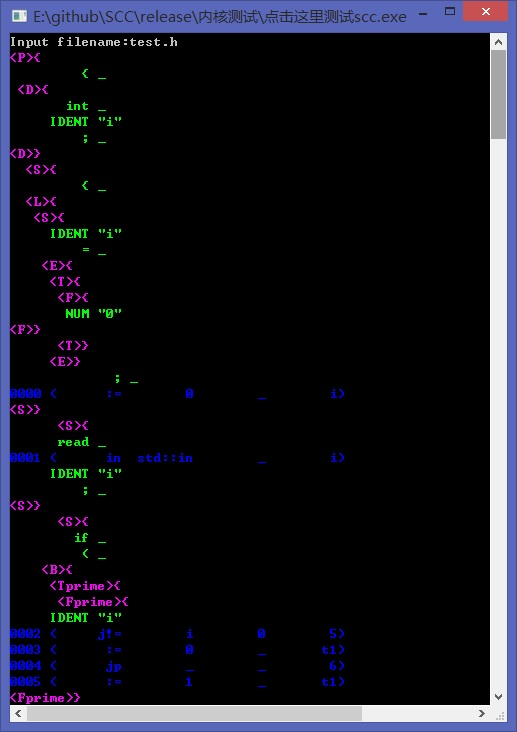
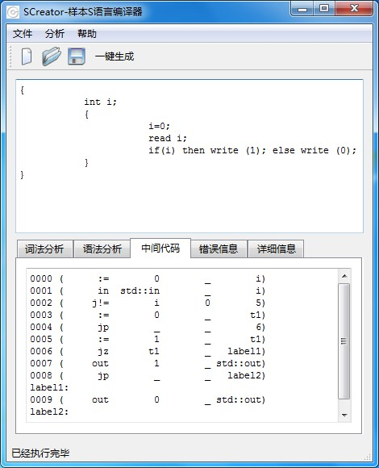

SCC
===

 * Downloads：	https://github.com/baidut/SCC/releases
 * Website：	http://baidut.github.io/SCC/

The Sample Compiler Collection (SCC) is a compiler system including:

 * The Sample Language's Core Compiler
 * GUI : SCreator

The Sample Language's Core Compiler
-----------------------------------

GUI : SCreator
--------------

